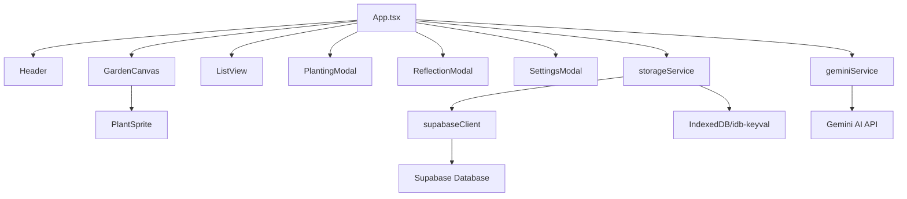

# MindGarden - Technical Documentation

## Table of Contents
- [Project Overview](#project-overview)
- [Architecture](#architecture)
- [Technology Stack](#technology-stack)
- [Core Components](#core-components)
- [Services](#services)
- [Type System](#type-system)
- [Setup & Configuration](#setup--configuration)
- [Development Guide](#development-guide)

---

## Project Overview

### Purpose
MindGarden is an AI-powered reflective journaling application that transforms thoughts into living visual metaphors. Users "plant" thoughts which are then analyzed by Gemini 3 AI to generate unique botanical imagery and reflective insights. These thoughts grow through four stages (seed, sprout, bloom, fruit) as users continue to reflect and update them.

### Key Features
- **AI-Powered Analysis**: Uses Gemini 3 Flash for thought analysis and reflection generation
- **AI-Generated Imagery**: Creates unique botanical illustrations using Gemini 3 Imagen for each thought
- **Growth System**: Thoughts evolve through four stages based on user engagement
- **Visual Garden**: Displays thoughts as plants on floating islands in an archipelago layout
- **Watering/Updates**: Users can add updates to thoughts, advancing their growth stage
- **Next Step Suggestions**: AI provides actionable next steps (do, clarify, reflect)
- **Hybrid Storage**: Supports both Supabase cloud storage and local IndexedDB fallback
- **Responsive Design**: Works on desktop and mobile devices

### Concept
The application uses botanical growth as a metaphor for thought development:
- **Seed**: Initial thought is planted
- **Sprout**: First reflection begins to emerge
- **Bloom**: Thought develops with updates and insights
- **Fruit**: Thought reaches maturity

---

## Architecture

### Application Structure



### Data Flow

1. **Planting a Thought**
   ```
   User Input → PlantingModal → geminiService.generateMindGardenContent()
   ↓
   [Gemini Analysis + Image Generation]
   ↓
   ThoughtCard Object → storageService.saveThought()
   ↓
   [Supabase or Local Storage] → Refresh Garden → UI Update
   ```

2. **Watering a Thought (Update)**
   ```
   User Update → ReflectionModal → geminiService.waterMindGardenThought()
   ↓
   [Gemini Analysis + Optional New Image]
   ↓
   Updated ThoughtCard → storageService.saveThought()
   ↓
   Storage → Refresh Garden → UI Update
   ```

### State Management
- **React Hooks**: Uses `useState` and `useEffect` for local state
- **No Global State Library**: Simple prop drilling for data flow
- **Storage as Source of Truth**: Data is loaded from storage on mount and refreshed after mutations

### Storage Strategy
The application uses a **hybrid storage approach**:

1. **Primary**: Supabase (if configured)
   - Cloud-based PostgreSQL database
   - Cross-device synchronization
   - User-scoped data via anonymous UUID

2. **Fallback**: Local IndexedDB (via `idb-keyval`)
   - Browser-local persistence
   - Works offline
   - No setup required

The `storageService` automatically selects the appropriate backend.

---

## Technology Stack

### Core Framework
- **React 19.2.3**: UI library
- **TypeScript 5.8.2**: Type safety
- **Vite 6.2.0**: Build tool and dev server

### UI & Styling
- **TailwindCSS 3.x** (via CDN): Utility-first CSS
- **Framer Motion 12.29.0**: Animations and transitions
- **Lucide React 0.563.0**: Icon library
- **Google Fonts**: Playfair Display (serif) and Outfit (sans-serif)

### AI & Generation
- **@google/genai 1.38.0**: Gemini API client
  - `gemini-3-flash-preview`: Text analysis and reflection
  - `gemini-3-flash-preview-i`: Image generation (Imagen)

### Storage
- **@supabase/supabase-js 2.39.0**: Cloud database client
- **idb-keyval 6.2.1**: IndexedDB wrapper for local storage

### Utilities
- **react-hot-toast 2.6.0**: Notification system

---

## Core Components

### [App.tsx](file:///Users/amberwang/Desktop/MindGarden/App.tsx)

**Purpose**: Main application container and orchestrator

**State**:
- `view`: Current view mode (GARDEN or LIST)
- `isPlanting`: Controls PlantingModal visibility
- `isSettingsOpen`: Controls SettingsModal visibility
- `isLoading`: Loading state for async operations
- `selectedThought`: Currently selected thought for detail view
- `gardenThoughts`: Array of all thought cards
- `hasApiKey`: Whether Gemini API key is available

**Key Functions**:
- `refreshGarden()`: Loads thoughts from storage and updates state
- `handlePlant(text)`: Creates new thought via AI, assigns position, saves to storage
- `handleWater(thought, updateText)`: Updates existing thought via AI, advances growth stage
- `handleDelete(id)`: Removes thought from storage
- `getNextAvailablePosition()`: Calculates placement for new thoughts using slot-based system

**Island Slot System**:
The app uses predefined coordinates for plant placement across multiple "islands":
- 12 slots per island (fixed coordinates)
- Islands scroll horizontally
- Slots are reused when thoughts are deleted (gap-filling algorithm)

### [GardenCanvas.tsx](file:///Users/amberwang/Desktop/MindGarden/components/GardenCanvas.tsx)

**Purpose**: Visual garden display with horizontal scrolling islands

**Features**:
- Horizontal scrolling container (snap-scroll on mobile)
- SVG island background (`island.svg`)
- Atmospheric particle effects
- Navigation controls for desktop
- Empty state prompt
- "Sow a New Seed" CTA button

**Layout**:
- Each island: 3:2 aspect ratio matching SVG dimensions
- Plants positioned as percentages relative to island container
- Responsive sizing for mobile and desktop

### [ListView.tsx](file:///Users/amberwang/Desktop/MindGarden/components/ListView.tsx)

**Purpose**: List view of all thoughts with categorization

**Features**:
- Groups thoughts by category
- Shows growth stage, emotion, and next steps
- Click to open ReflectionModal
- Grid layout on larger screens

### [PlantingModal.tsx](file:///Users/amberwang/Desktop/MindGarden/components/PlantingModal.tsx)

**Purpose**: Modal for creating new thoughts

**Features**:
- Text input for user's thought
- Category selection (idea, todo, worry, feeling, goal, memory, other)
- Loading state during AI generation
- Glassmorphic design with backdrop blur

### [ReflectionModal.tsx](file:///Users/amberwang/Desktop/MindGarden/components/ReflectionModal.tsx)

**Purpose**: Detailed view of a single thought

**Features**:
- Displays plant image, reflection, and metadata
- Shows growth stage and emotion
- Next step suggestions (if available)
- Growth log with timeline:
  - Original seed (initial thought)
  - All updates with AI responses
- Watering form (for non-fruit thoughts)
- Delete functionality

**UI Design**:
- Circular plant image with gradient halo
- Timeline visualization for updates
- Responsive single-column layout
- Footer with creation date and delete button

### [SettingsModal.tsx](file:///Users/amberwang/Desktop/MindGarden/components/SettingsModal.tsx)

**Purpose**: Configuration panel for Supabase

**Features**:
- Input for Supabase URL and API key
- Save/clear functionality
- Updates `supabaseClient` configuration

### [PlantSprite.tsx](file:///Users/amberwang/Desktop/MindGarden/components/PlantSprite.tsx)

**Purpose**: Individual plant component in garden

**Features**:
- Positioned absolutely based on `thought.position`
- Displays plant image
- Growth stage indicator (colored dot)
- "New" badge if unviewed
- Hover and click interactions
- Framer Motion animations (layout, hover, tap)

### [Header.tsx](file:///Users/amberwang/Desktop/MindGarden/components/Header.tsx)

**Purpose**: Top navigation bar

**Features**:
- App title and branding
- View switcher (Garden ⇄ List)
- Settings button
- Glassmorphic design

---

## Services

### [geminiService.ts](file:///Users/amberwang/Desktop/MindGarden/services/geminiService.ts)

**Purpose**: AI integration for content generation and analysis

#### Configuration
```typescript
const TEXT_MODEL = "gemini-3-flash-preview";
const IMAGE_MODEL = "gemini-3-flash-preview-i";
const IMAGE_SIZE = 512;
```

#### Main Functions

##### `generateMindGardenContent(text: string): Promise<GeneratedContent>`
Creates a new thought with AI analysis and imagery.

**Process**:
1. Calls `analyzeTextAndReflect(text)` for metadata
2. Calls `generateBotanyImage()` for plant image
3. Returns `GeneratedContent` object

**Returns**:
```typescript
{
  imageUrl: string,      // Data URL of generated image
  reflection: string,    // AI-generated reflection
  meta: ThoughtMeta      // Structured metadata
}
```

##### `waterMindGardenThought(thought: ThoughtCard, updateText: string): Promise<WateringResponse>`
Updates an existing thought and potentially advances growth stage.

**Process**:
1. Analyzes update in context of original thought and history
2. Determines new growth stage
3. Generates new image if stage advances
4. Returns acknowledgment and updated data

**Returns**:
```typescript
{
  acknowledgment: string,     // AI response to update
  newStage: GrowthStage,      // Updated stage
  hasNextStep: boolean,       // Whether next step exists
  nextStep: NextStep | null,  // Action suggestion
  newImageUrl?: string        // New image if stage changed
}
```

#### Helper Functions

##### `analyzeTextAndReflect(userText: string): Promise<AnalysisResponse>`
Analyzes user input using structured output schema.

**Structured Output Schema**:
- `emotion`: Dominant emotion (string)
- `intensity`: Emotional intensity (low/medium/high)
- `reflection`: Poetic reflection (2-3 sentences)
- `category`: Thought category (ThoughtCategory enum)
- `topic`: Short label (3-6 words)
- `hasNextStep`: Boolean
- `nextStep`: Object with `text`, `type` (do/clarify/reflect), `confidence`

##### `generateBotanyImage(species: string, stage: GrowthStage, emotion: string): Promise<string>`
Generates botanical imagery using Imagen.

**Prompt Construction**:
- Base style: "Delicate digital watercolor botanical illustration"
- Includes species, stage description, emotional quality
- Negative prompt to exclude unwanted elements
- Returns base64 data URL

**Error Handling**:
- Retry logic with exponential backoff
- Fallback to placeholder SVG on failure

##### `getClient()`
Returns configured Gemini client using AI Studio API key or environment variable.

---

### [storageService.ts](file:///Users/amberwang/Desktop/MindGarden/services/storageService.ts)

**Purpose**: Hybrid data persistence layer

#### Storage Keys
```typescript
const STORAGE_KEY = 'mindgarden_thoughts_v1';
const USER_ID_KEY = 'mindgarden_user_id';
```

#### Exported Functions

##### `saveThought(thought: ThoughtCard): Promise<void>`
Saves or updates a thought card.

**Logic**:
- Checks if Supabase is configured
- Routes to `saveToSupabase()` or `saveToLocal()`
- Handles errors and throws

##### `getThoughts(): Promise<ThoughtCard[]>`
Retrieves all thoughts for current user.

**Logic**:
- Attempts Supabase first
- Falls back to local storage on error
- Returns empty array if both fail

##### `deleteThought(id: string): Promise<void>`
Deletes a thought by ID.

#### Supabase Implementation

**Schema** (assumed):
```sql
Table: thoughts
- id: text (primary key, matches ThoughtCard.id)
- user_id: text (anonymous UUID)
- data: jsonb (entire ThoughtCard object)
- created_at: bigint (timestamp)
```

**User ID**: Generated UUID stored in localStorage, scopes all queries

#### Local Storage Implementation
Uses `idb-keyval` for IndexedDB storage:
- Single key: `mindgarden_thoughts_v1`
- Value: Array of ThoughtCard objects
- Updates merge by ID

---

### [supabaseClient.ts](file:///Users/amberwang/Desktop/MindGarden/services/supabaseClient.ts)

**Purpose**: Supabase client initialization and configuration

#### Configuration Sources
1. Environment variables: `process.env.SUPABASE_URL`, `process.env.SUPABASE_KEY`
2. LocalStorage: User-configured values from SettingsModal

#### Exported Functions

##### `getSupabase(): SupabaseClient | null`
Returns singleton Supabase client or null if not configured.

##### `updateSupabaseConfig(url: string, key: string)`
Updates configuration and recreates client.

##### `getStoredConfig()`
Returns current URL and key from storage or env.

---

## Type System

### Core Types ([types.ts](file:///Users/amberwang/Desktop/MindGarden/types.ts))

#### Enums and Literals

```typescript
type ThoughtCategory = 'idea' | 'todo' | 'worry' | 'feeling' | 'goal' | 'memory' | 'other';
type NextStepType = 'do' | 'clarify' | 'reflect';
type GrowthStage = 'seed' | 'sprout' | 'bloom' | 'fruit';

enum AppView {
  GARDEN = 'GARDEN',
  LIST = 'LIST'
}
```

#### Interfaces

##### `NextStep`
```typescript
interface NextStep {
  text: string;           // Action suggestion text
  type: NextStepType;     // Category of action
  confidence: number;     // AI confidence (0-1)
}
```

##### `ThoughtMeta`
```typescript
interface ThoughtMeta {
  emotion: string;              // Dominant emotion
  intent?: string;              // Legacy field (optional)
  intensity: 'low' | 'medium' | 'high';
  metaphors: string[];          // Legacy field
  plantSpecies: string;         // Visual consistency identifier
  category: ThoughtCategory;
  topic: string;                // Short label (3-6 words)
  hasNextStep: boolean;
  nextStep: NextStep | null;
}
```

##### `GeneratedContent`
```typescript
interface GeneratedContent {
  imageUrl: string;       // Data URL of plant image
  reflection: string;     // AI-generated reflection
  meta: ThoughtMeta;
}
```

##### `Position`
```typescript
interface Position {
  x: number;  // Percentage 0-100 (with island offset)
  y: number;  // Percentage 0-100
}
```

##### `ThoughtUpdate`
```typescript
interface ThoughtUpdate {
  id: string;
  timestamp: number;
  text: string;                   // User's update
  aiResponse: string;             // AI acknowledgment
  previousStage: GrowthStage;
  newStage: GrowthStage;
  nextStep?: NextStep | null;
}
```

##### `WateringResponse`
```typescript
interface WateringResponse {
  acknowledgment: string;
  newStage: GrowthStage;
  hasNextStep: boolean;
  nextStep: NextStep | null;
  newImageUrl?: string;  // Present if stage changed
}
```

##### `ThoughtCard` (Main Data Model)
```typescript
interface ThoughtCard extends GeneratedContent {
  id: string;                    // UUID
  originalText: string;          // User's initial thought
  createdAt: number;             // Unix timestamp
  position: Position;            // Garden placement
  hasViewed: boolean;           // "New" badge flag
  growthStage: GrowthStage;     // Current stage
  updates: ThoughtUpdate[];     // Update history
}
```

---

## Setup & Configuration

### Prerequisites
- **Node.js** (version 18+ recommended)
- **Gemini API Key** from [AI Studio](https://aistudio.google.com)
- **Supabase Project** (optional, for cloud storage)

### Installation

1. **Clone the repository**:
   ```bash
   git clone <repository-url>
   cd MindGarden
   ```

2. **Install dependencies**:
   ```bash
   npm install
   ```

3. **Configure Gemini API Key**:
   
   The app checks for API keys in this order:
   - AI Studio browser extension (if running in AI Studio)
   - Environment variable `GEMINI_API_KEY`
   
   Create a `.env` file:
   ```bash
   GEMINI_API_KEY=your_api_key_here
   ```

4. **Configure Supabase** (Optional):
   
   For cloud storage, either:
   
   **Option A**: Environment variables
   ```bash
   SUPABASE_URL=your_supabase_url
   SUPABASE_KEY=your_supabase_anon_key
   ```
   
   **Option B**: Settings modal in the app UI
   
   **Supabase Schema**:
   ```sql
   CREATE TABLE thoughts (
     id TEXT PRIMARY KEY,
     user_id TEXT NOT NULL,
     data JSONB NOT NULL,
     created_at BIGINT NOT NULL
   );
   
   CREATE INDEX idx_thoughts_user_id ON thoughts(user_id);
   ```

### Running Locally

```bash
npm run dev
```

Access at `http://localhost:5173` (or port shown in terminal)

### Building for Production

```bash
npm run build
```

Output in `dist/` directory.

### Preview Production Build

```bash
npm run preview
```

---

## Development Guide

### Project Structure

```
MindGarden/
├── components/           # React components
│   ├── GardenCanvas.tsx
│   ├── Header.tsx
│   ├── ListView.tsx
│   ├── PlantingModal.tsx
│   ├── PlantSprite.tsx
│   ├── ReflectionModal.tsx
│   └── SettingsModal.tsx
├── services/            # Business logic and external services
│   ├── geminiService.ts
│   ├── storageService.ts
│   └── supabaseClient.ts
├── App.tsx              # Main application component
├── index.tsx            # React entry point
├── types.ts             # TypeScript type definitions
├── index.html           # HTML template with Tailwind config
├── vite.config.ts       # Vite configuration
├── tsconfig.json        # TypeScript configuration
├── package.json         # Dependencies and scripts
├── island.svg           # Garden island SVG graphic
└── .env                 # Environment variables (gitignored)
```

### Key Patterns

#### Adding a New Component
1. Create file in `components/` directory
2. Define props interface
3. Use Framer Motion for animations
4. Import into `App.tsx` and wire up state/handlers

#### Extending Thought Metadata
1. Update `ThoughtMeta` interface in `types.ts`
2. Update structured output schema in `geminiService.ts`
3. Adjust UI components to display new fields

#### Customizing AI Prompts
- Edit system prompts in `geminiService.ts`
- Adjust structured output schemas for different metadata
- Modify image generation prompts for different visual styles

#### Styling Guidelines
- Use Tailwind utility classes
- Custom colors defined in `index.html` Tailwind config:
  - `paper`: #FDFCF8 (off-white background)
  - `ink`: #4A4646 (text color)
  - `dream.*`: Pastel palette for accents
- Font families: `font-serif` (Playfair Display), `font-sans` (Outfit)

### Common Tasks

#### Changing Growth Stages
Modify `GrowthStage` type and update:
- Stage descriptions in `geminiService.ts` (`STAGE_DESCRIPTIONS`)
- Image prompts in `generateBotanyImage()`
- UI indicators in components

#### Adjusting Island Layout
- Edit `ISLAND_SLOTS` array in `App.tsx`
- Modify coordinates as percentages (x: 0-100, y: 0-100)
- Update `getNextAvailablePosition()` logic if changing slot count

#### Adding New Thought Categories
1. Update `ThoughtCategory` type in `types.ts`
2. Update UI category selector in `PlantingModal.tsx`
3. Optionally adjust AI prompts to handle new category

---

## API Reference

### Gemini AI Usage

#### Models Used
- **gemini-3-flash-preview**: Text generation with structured output
- **gemini-3-flash-preview-i**: Image generation (Imagen)

#### Rate Limiting
- Retry logic with exponential backoff (up to 2 retries)
- Delays of 1000ms between retries

#### Error Handling
- Network errors: Retry with backoff
- Image generation failures: Fallback to SVG placeholder
- API key errors: Show unlock screen

### Storage API

All storage operations return `Promise<void>` or `Promise<ThoughtCard[]>`.

```typescript
// Save or update
await saveThought(thoughtCard);

// Retrieve all
const thoughts = await getThoughts();

// Delete
await deleteThought(thoughtId);
```

### Framer Motion Animations

Common patterns used:

```typescript
// Layout animations
<motion.div layoutId={thought.id}>

// Entrance/exit
<motion.div 
  initial={{ opacity: 0, scale: 0.9 }}
  animate={{ opacity: 1, scale: 1 }}
  exit={{ opacity: 0, scale: 0.9 }}
>

// Hover effects
<motion.button
  whileHover={{ scale: 1.05 }}
  whileTap={{ scale: 0.95 }}
>
```

---

## Troubleshooting

### Common Issues

**Problem**: "API Key required" error  
**Solution**: Ensure `GEMINI_API_KEY` is set in `.env` file or available via AI Studio

**Problem**: Thoughts not persisting  
**Solution**: Check browser console for storage errors. Verify Supabase config or check IndexedDB in browser DevTools

**Problem**: Images not generating  
**Solution**: Check API key permissions for Imagen model. Fallback SVG should still appear.

**Problem**: Garden layout looks misaligned  
**Solution**: Verify `island.svg` aspect ratio is 3:2. Check that plant positions are percentages 0-100.

---

## Future Enhancements

Potential areas for extension:
- User authentication (replace anonymous UUID)
- Sharing thoughts with others
- Export/import functionality
- Custom plant species selection
- Seasonal themes or backgrounds
- Sound effects and ambient audio
- Mobile app (React Native)
- Multiple gardens or collections

---

## License

This project is part of AI Studio. Refer to the main repository for license information.

---

## Support

For issues or questions:
- Check the [GitHub Issues](https://github.com/user/mindgarden/issues)
- Review Gemini API documentation at [ai.google.dev](https://ai.google.dev)
- Supabase documentation at [supabase.com/docs](https://supabase.com/docs)
