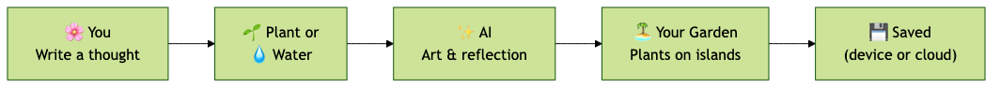

<div align="center">

</div>

# 🌿 MindGarden

**Plant a thought, watch it grow into art.**

MindGarden is an AI-powered reflective journaling application that transforms your thoughts into living botanical illustrations. Using advanced AI (Gemini 3), each thought you plant becomes a unique piece of generative art that evolves through growth stages as you reflect and update it over time.

---

## ✨ Features

- 🎨 **AI-Generated Botanical Art** - Every thought becomes a unique watercolor plant illustration
- 🌱 **Growth Stages** - Thoughts evolve from seed → sprout → bloom → fruit
- 🤖 **Poetic Reflections** - AI analyzes your thoughts and generates insightful reflections
- 💡 **Actionable Next Steps** - Get AI-suggested actions: do, clarify, or reflect
- 🏝️ **Visual Garden** - Organize thoughts spatially on beautiful floating islands
- 💧 **Watering System** - Add updates to thoughts and watch them grow
- 📱 **Responsive Design** - Works seamlessly on desktop and mobile
- 🔐 **Privacy-First** - Local storage by default, optional cloud sync with Supabase
- 🎭 **Emotion Tracking** - Each thought is tagged with emotional qualities
- 📊 **Multiple Views** - Switch between immersive garden view and organized list view
- 🎵 **Mood-based Music** (optional) - AI suggests Spotify tracks that match your thought’s mood

---

## 🎯 What Makes It Special

Unlike traditional journaling apps, MindGarden:
- **Visualizes thoughts spatially** rather than chronologically
- **Creates unique art** for each thought using generative AI
- **Encourages revisiting** through the "watering" metaphor
- **Provides AI companionship** with thoughtful reflections and suggestions
- **Celebrates growth** by showing visual evolution through stages

---

## 🚀 Quick Start

### Prerequisites

- **Node.js** v18 or higher ([nodejs.org](https://nodejs.org))
- **npm** (included with Node)
- **Gemini API key** from [Google AI Studio](https://aistudio.google.com) — required for planting thoughts and AI art

### 1. Get the code

```bash
git clone <your-repo-url>
cd MindGarden
```

(If you already have the project, just open its folder in the terminal.)

### 2. Install dependencies

```bash
npm install
```

### 3. Configure environment

Create a `.env` file in the project root. **Only `GEMINI_API_KEY` is required** to run the app; the rest are optional.

**Required (core features):**

```bash
GEMINI_API_KEY=your_gemini_api_key_here
```

Get your key at [Google AI Studio](https://aistudio.google.com).  
**Note:** If you run the app inside **AI Studio**, the browser extension can supply the API key — you may not need `.env` there.

**Optional — Supabase (cloud sync across devices):**

```bash
SUPABASE_URL=your_supabase_project_url
SUPABASE_KEY=your_supabase_anon_key
```

You can also set these later in the app via **Settings** (⚙️).

**Optional — Spotify (mood-based song suggestions):**

```bash
SPOTIFY_CLIENT_ID=your_spotify_client_id
SPOTIFY_CLIENT_SECRET=your_spotify_client_secret
```

Create an app at [Spotify Developer Dashboard](https://developer.spotify.com/dashboard). Without these, thoughts still plant and grow; they just won’t show a music recommendation.

### 4. Run the app

```bash
npm run dev
```

Open your browser at **http://localhost:5173** (or the port Vite prints in the terminal if 5173 is in use).

### Available scripts

| Command           | Description                          |
|-------------------|--------------------------------------|
| `npm run dev`     | Start development server (hot reload) |
| `npm run build`   | Build for production → output in `dist/` |
| `npm run preview` | Serve the production build locally   |

---

## 📖 Documentation

- **[USER_GUIDE.md](USER_GUIDE.md)** - Complete user manual with tips and best practices
- **[DOCUMENTATION.md](DOCUMENTATION.md)** - Technical documentation and architecture diagrams
- **[DEPLOY_VERCEL.md](DEPLOY_VERCEL.md)** - Deploy to Vercel step-by-step
- **[DEMO_SCRIPT.md](DEMO_SCRIPT.md)** - Demo script and talking points

---

## 🛠️ Technology Stack

- **Frontend**: React 19 + TypeScript + Vite
- **Styling**: TailwindCSS + Custom Design System
- **Animations**: Framer Motion
- **AI**: Google Gemini 3 Flash (text) + Imagen (visual generation)
- **Storage**: Hybrid (IndexedDB local + optional Supabase cloud)
- **Icons**: Lucide React

---

## 🌱 How It Works

1. **Plant** - Write a thought and select a category (idea, todo, worry, feeling, goal, memory)
2. **AI Magic** - Gemini analyzes your thought, generates a reflection, and creates botanical art
3. **Garden** - Your thought appears as a plant on a floating island
4. **Water** - Add updates over time to help your thought grow through stages
5. **Bloom** - Watch as your thoughts evolve from seeds to fully mature plants

### Architecture (user perspective)

<div align="center">

</div>

*From your perspective: you write a thought, plant or water it, AI creates art and reflections, and your garden is saved on your device or in the cloud.*

For the **technical architecture** (components, services, APIs), see [DOCUMENTATION.md](DOCUMENTATION.md#architecture).

---

## 🎨 Growth Stages

| Stage | Icon | Description |
|-------|------|-------------|
| **Seed** | 🌰 | Freshly planted, full of potential |
| **Sprout** | 🌱 | Beginning to emerge and take shape |
| **Bloom** | 🌸 | Flourishing with insights and growth |
| **Fruit** | 🍎 | Mature and complete |

Each stage brings new AI-generated artwork showing your plant's development!

---

## 🔧 Optional configuration

Environment variables are described in [Quick Start](#-quick-start). Summary:

- **Supabase** — For cloud sync. Create a project at [supabase.com](https://supabase.com), then run this SQL to create the `thoughts` table:

  ```sql
  CREATE TABLE thoughts (
    id TEXT PRIMARY KEY,
    user_id TEXT NOT NULL,
    data JSONB NOT NULL,
    created_at BIGINT NOT NULL
  );
  CREATE INDEX idx_thoughts_user_id ON thoughts(user_id);
  ```

  Add `SUPABASE_URL` and `SUPABASE_KEY` to `.env`, or set them in the app via **Settings** (⚙️).

- **Spotify** — For mood-based song suggestions. Create an app at [Spotify Developer Dashboard](https://developer.spotify.com/dashboard), add `SPOTIFY_CLIENT_ID` and `SPOTIFY_CLIENT_SECRET` to `.env`. For local dev, redirect URI can be `http://localhost:5173`. The app runs fully without Spotify; thoughts just won’t show a music card.

---

## 🎭 Use Cases

- **Creative Brainstorming** - Plant ideas and watch them develop
- **Goal Tracking** - Water your goals with progress updates
- **Emotional Processing** - Reflect on feelings as they evolve
- **Gratitude Practice** - Plant memories and positive moments
- **Problem Solving** - Break down worries through AI-guided reflection
- **Personal Growth** - Track how your thinking changes over time

---

## 🤝 Contributing

This project is part of Google AI Studio. For contributions:
1. Fork the repository
2. Create a feature branch
3. Make your changes
4. Submit a pull request

---

## 📄 License

This project is developed as part of AI Studio. See the repository for license details.

---

## 🙏 Acknowledgments

- **Google DeepMind** - Gemini AI models
- **AI Studio** - Platform and infrastructure
- **Open Source Community** - React, Vite, TailwindCSS, and all dependencies

---

## 🐛 Troubleshooting

| Issue | What to do |
|-------|------------|
| **"API key required" or unlock screen** | Add `GEMINI_API_KEY` to `.env`, or use the app from AI Studio so the extension can provide the key. Restart the dev server after changing `.env`. |
| **Port 5173 already in use** | Vite will offer another port (e.g. 5174). Use the URL shown in the terminal. |
| **Images not generating** | Ensure your Gemini API key has access to the image model. Fallback plant SVGs will still appear. |
| **Thoughts not saving** | Don’t use incognito/private mode if relying on local IndexedDB, or set up Supabase for cloud storage. |
| **`npm run dev` fails** | Use Node v18+. Run `npm install` again. Check [DOCUMENTATION.md](DOCUMENTATION.md#troubleshooting) for more. |

**Need help?** See [USER_GUIDE.md](USER_GUIDE.md) (using the app) or [DOCUMENTATION.md](DOCUMENTATION.md) (technical setup and troubleshooting).

---

<div align="center">

**Made with 🌱 and AI**

[Documentation](DOCUMENTATION.md) • [User Guide](USER_GUIDE.md) • [Deploy to Vercel](DEPLOY_VERCEL.md)

</div>
